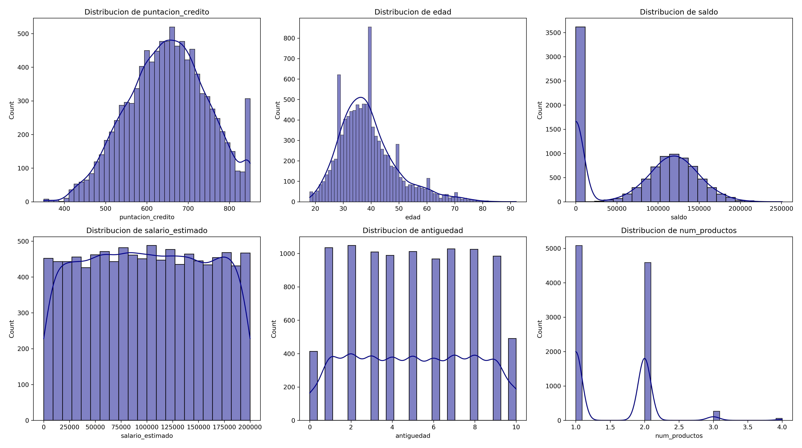

# Análisis y Resultados

Este documento contiene los resultados del análisis exploratorio de los clientes del banco, incluyendo estadísticas descriptivas, histogramas y boxplots. El objetivo es obtener un perfil general del cliente del banco y detectar patrones que puedan influir en el abandono -> PDTE: Ajustar cuando tengamos todos los analisis hechos

---

## 1️⃣ Perfil genérico del cliente

## 1️.1. Análisis de la distribución de variables numéricas

Este análisis se basa en histogramas y estadísticas descriptivas para entender cómo se distribuyen los clientes según diferentes métricas.

### 🔹 **Histogramas**

A continuación, se presentan las distribuciones de las principales variables numéricas:

### 🔹 **Distribución de puntuación de crédito**

- Distribución **normal sesgada a la izquierda**, con valores entre **600 y 750**.
- Pico inusual en **850**, lo que indica clientes con excelente historial crediticio.
- Algunos valores atípicos en los puntajes más bajos (~350-450), lo que podría representar clientes con mayor riesgo financiero.

### 🔹 **Distribución de edad**

- Mayoría de clientes entre **30 y 50 años**.
- Picos en ciertas edades, lo que sugiere estrategias comerciales enfocadas en grupos específicos.
- **Grupo de clientes mayores de 60 años con valores atípicos**, que podrían tener necesidades distintas, se estudiará de manera más detallada.

### 🔹 **Distribución de saldo**

- Gran cantidad de clientes con **saldo 0**, lo que sugiere inactividad o bajo uso del banco, podría ser punto de estudio más detallado.
- **Distribución bimodal**, con otro grupo fuerte alrededor de **100.000**.
- El segmento con saldo bajo podría estar en **riesgo de abandono**.

### 🔹 **Distribución de salario estimado**

- **Distribución uniforme**, indicando que el banco atiende a clientes de distintos niveles salariales.
- No hay valores atípicos en esta variable.

---

## 1.2️. Análisis de valores atípicos (Boxplots)

Los boxplots nos permiten visualizar valores extremos que pueden ser clave para entender el comportamiento de los clientes.

### 🔹 **Boxplots de variables numéricas**

A continuación, se presentan los boxplots de las variables analizadas:

### 🔹 **Puntuación de crédito**

- Mediana alrededor de **650-700**.
- **Valores atípicos en la parte baja (~350-450)**, indicando clientes de alto riesgo financiero.

### 🔹 **Edad**

- La mayoría de los clientes tienen entre **30 y 50 años**.
- **Muchos valores atípicos en edades superiores a 60 años**, lo que indica la existencia de un grupo de clientes mayores con patrones distintos, se realizará un estudio detallado.

### 🔹 **Saldo**

- Se confirma la presencia de **clientes con saldo 0**, lo que coincide con el análisis de histogramas.
- Gran variabilidad en los saldos, con clientes que llegan hasta **250.000**.
- **El segmento con saldo 0 podría estar inactivo o en riesgo de abandono**.

### 🔹 **Salario estimado**

- No presenta valores atípicos.
- Se mantiene la distribución homogénea observada en los histogramas.

---

📌 **Basándonos en los análisis anteriores, el perfil general del cliente del banco es el siguiente:**

✅ **Edad promedio:** Entre **30 y 50 años**, siendo 39 años la edad media.
✅ **Saldo promedio:** Alrededor de **100.000**, aunque existe un grupo con saldo **0**.  
✅ **Puntuación de crédito promedio:** Entre **600 y 750**, con pocos clientes de alto riesgo.  
✅ **Salario estimado:** Distribuido de manera uniforme, indicando diversidad en niveles salariales, no parece ser un factor diferenciador en el comportamiento de los clientes.
✅ **País predominante:** **Francia (50,1%)**, seguido de Alemania (25,1%) y España con (24,8%).  
✅ **Distribución por género:** **Más clientes hombres que mujeres**, aunque la distribución es bastante homogénea (**54,6%** y **45,4% respectivamente**).  
✅ **Grupo con valores atípicos:** Clientes mayores de **60 años** y clientes con saldo **0**, que podrían comportarse de manera diferente.

---
