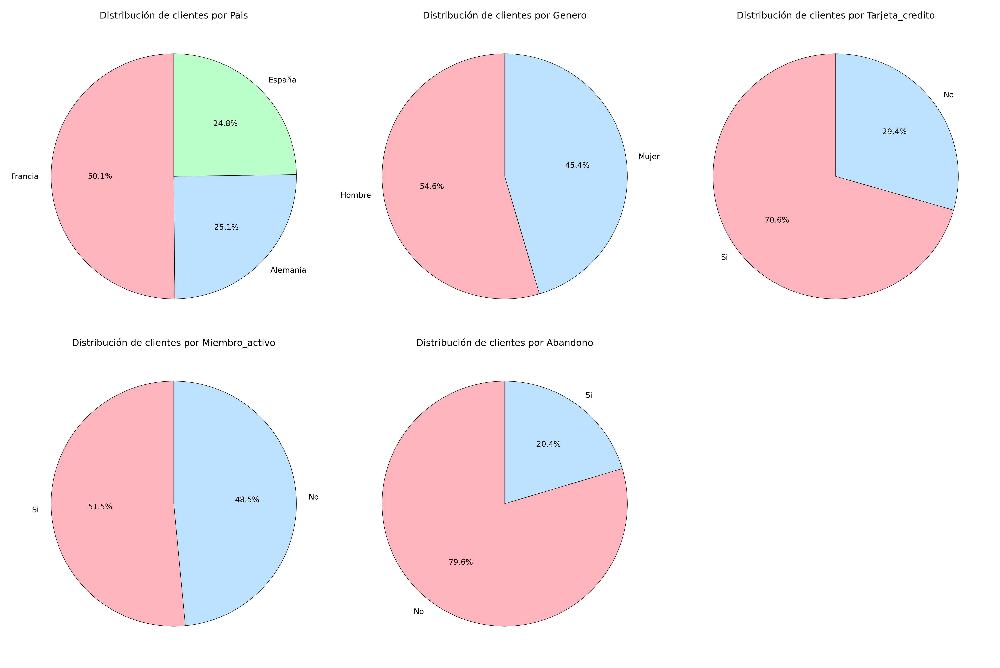
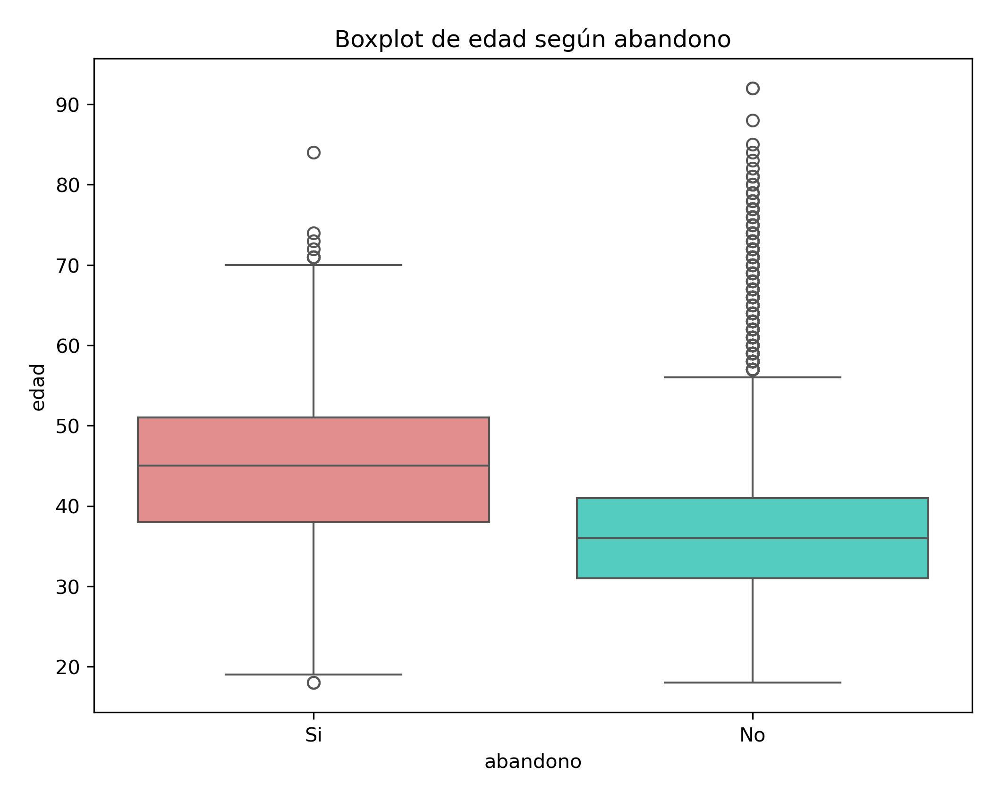
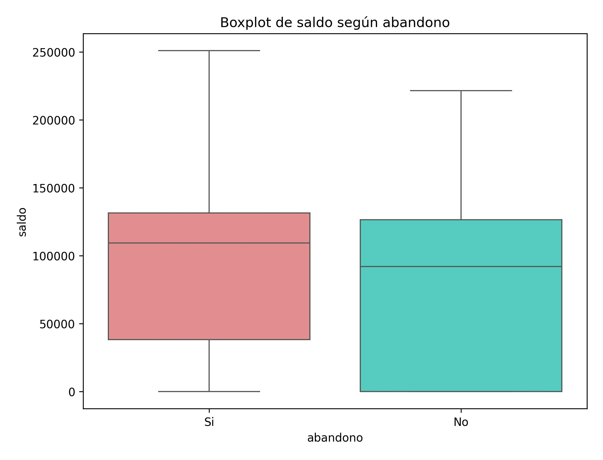

# Análisis y Resultados

Este documento contiene los resultados del análisis exploratorio de los clientes del banco, incluyendo estadísticas descriptivas, histogramas y boxplots. El objetivo es obtener un perfil general del cliente del banco y detectar patrones que puedan influir en el abandono -> PDTE: Ajustar cuando tengamos todos los analisis hechos

---

## 1️⃣ Perfil genérico del cliente

## 1️.1. Análisis de la distribución de variables categóricas

Los gráficos de tipo pie chart permiten visualizar la proporción de clientes en cada una de las categorícas analizadas.

### 🔹 **Pie chart de variables categorícas**

A continuación, se presentan los Pie chart de las variables analizadas:

### 🔹 **País**

- La mayoría de los clientes provienen de **Francia (50,1%)**, seguido por **Alemania (25,1%)** y **España (24,8%)**.
- Francia representa la mitad de la base de clientes, lo que podría influir en análisis posteriores.

### 🔹 **Género**

- **Hombres (54,6%)** y **Mujeres (45,4%)**.
- La diferencia no es drástica, pero podría ser relevante para el análisis de abandono.

### 🔹 **Tarjeta de crédito**

- **70,6% de los clientes poseen tarjeta de crédito**, mientras que el **29,4% no**.
- Podría ser interesante evaluar si esta variable influye en el abandono.

### 🔹 **Membresía activa**

- **51,5% de los clientes están activos**, mientras que el **48,5% están inactivos**.
- Esto indica que el banco tiene casi la misma cantidad de clientes activos e inactivos, lo que puede ser un factor a considerar en estrategias de fidelización.

### 🔹 **Abandono**

- **79,6% de los clientes nunca han abandonado**, mientras que el **20,4% ha abandonado alguna vez, pero actualmente sigue en el banco**.
- Esto indica que, aunque la mayoría de los clientes han permanecido en la entidad sin interrupciones, hay un grupo significativo que en algún momento decidió abandonar y luego regresó.
- Analizar las razones detrás de estos abandonos y reingresos podría proporcionar información valiosa para mejorar la retención de clientes.

---

## 1️.2. Análisis de la distribución de variables numéricas

Este análisis se basa en histogramas y estadísticas descriptivas para entender cómo se distribuyen los clientes según diferentes métricas.

### 🔹 **Histogramas**

A continuación, se presentan las distribuciones de las variables numéricas:

### 🔹 **Distribución de puntuación de crédito**

- Distribución **normal sesgada a la izquierda**, con valores entre **600 y 750**.
- Pico inusual en **850**, lo que indica clientes con excelente historial crediticio.
- Algunos valores atípicos en los puntajes más bajos (~350-450), lo que podría representar clientes con mayor riesgo financiero.

### 🔹 **Distribución de edad**

- Mayoría de clientes entre **30 y 50 años**.
- Picos en ciertas edades, lo que sugiere estrategias comerciales enfocadas en grupos específicos.
- **Grupo de clientes mayores de 60 años con valores atípicos**, que podrían tener necesidades distintas, se estudiará de manera más detallada.

### 🔹 **Distribución de saldo**

- Gran cantidad de clientes con **saldo 0**, lo que sugiere inactividad o bajo uso del banco, podría ser punto de estudio más detallado.
- **Distribución bimodal**, con otro grupo fuerte alrededor de **100.000**.
- El segmento con saldo bajo podría estar en **riesgo de abandono**.

### 🔹 **Distribución de salario estimado**

- **Distribución uniforme**, indicando que el banco atiende a clientes de distintos niveles salariales.
- No hay valores atípicos en esta variable.

### 🔹 **Distribución de antigüedad**

- Distribución **uniforme**, sin grandes variaciones entre años.
- **Sin valores atípicos**, lo que indica estabilidad en la captación de clientes.
- No hay una concentración clara en ciertos rangos de antigüedad.

### 🔹 **Distribución de número de productos**

- **Distribución multimodal**, con picos en **1, 2 y 3 productos**.
- La mayoría de clientes tienen **1 o 2 productos**, mientras que los que tienen **4 productos** son pocos y pueden representar un segmento especial.

---

## 1.3. Análisis de valores atípicos (Boxplots)

Los boxplots nos permiten visualizar valores extremos que pueden ser clave para entender el comportamiento de los clientes.

### 🔹 **Boxplots de variables numéricas**

A continuación, se presentan los boxplots de las variables analizadas:

### 🔹 **Puntuación de crédito**

- Mediana alrededor de **650-700**.
- **Valores atípicos en la parte baja (~350-450)**, indicando clientes de alto riesgo financiero.

### 🔹 **Edad**

- La mayoría de los clientes tienen entre **30 y 50 años**.
- **Muchos valores atípicos en edades superiores a 60 años**, lo que indica la existencia de un grupo de clientes mayores con patrones distintos.

### 🔹 **Saldo**

- Se confirma la presencia de **clientes con saldo 0**, lo que coincide con el análisis de histogramas.
- Gran variabilidad en los saldos, con clientes que llegan hasta **250.000**.
- **El segmento con saldo 0 podría estar inactivo o en riesgo de abandono**.

### 🔹 **Salario estimado**

- No presenta valores atípicos.
- Se mantiene la distribución homogénea observada en los histogramas.

### 🔹 **Boxplots de antigüedad**

- **Sin valores extremos** ni anomalías en la distribución.
- Esto indica que el banco ha estado adquiriendo clientes de manera constante a lo largo del tiempo.

### 🔹 **Boxplots de número de productos**

- **Clientes con 4 productos aparecen como valores atípicos**, lo que podría indicar un grupo de alto valor.
- Los clientes con menos productos pueden ser **más propensos al abandono**.

---

📌 **Basándonos en los análisis anteriores, el perfil general del cliente del banco es el siguiente:**

✅ **Edad promedio:** Entre **30 y 50 años**, siendo 39 años la edad media.  
✅ **Saldo promedio:** Alrededor de **100.000**, aunque existe un grupo con saldo **0**.  
✅ **Puntuación de crédito promedio:** Entre **600 y 750**, con pocos clientes de alto riesgo.  
✅ **Salario estimado:** Distribuido de manera uniforme, indicando diversidad en niveles salariales, no parece ser un factor diferenciador en el comportamiento de los clientes.  
✅ **Antigüedad en el banco:** Distribución **uniforme**, sin valores atípicos, lo que indica una captación de clientes constante en el tiempo.  
✅ **Número de productos contratados:** La mayoría de clientes tienen **1 o 2 productos**, mientras que un grupo reducido con **4 productos** puede representar un segmento especial del banco.  
✅ **País predominante:** **Francia (50,1%)**, seguido de Alemania (25,1%) y España con (24,8%).  
✅ **Distribución por género:** **Más clientes hombres que mujeres**, aunque la distribución es bastante homogénea (**54,6%** y **45,4% respectivamente**).  
✅ La mayoría de los clientes **(70,6%) tienen tarjeta de crédito**, lo que indica que es un producto clave en la relación con el banco.
✅ El porcentaje de **miembros activos y no activos es similar (51,5% y 48,5% respectivamente)**, lo que podría indicar oportunidades de fidelización.
✅ **El 79,6% de los clientes nunca han abandonado el banco**, lo que indica una tasa de retención alta, pero es importante identificar qué factores influyen en el abandono.
✅ **Grupo con valores atípicos:** Clientes mayores de **60 años**, clientes con saldo **0** y clientes con **4 productos**, que podrían comportarse de manera diferente.

🔍 A continuación se analizará el **perfil de los clientes que han abandonado alguna vez el banco**, comparándolo con aquellos que nunca lo han hecho, para identificar los factores que podrían influir en el abandono. Se evaluarán variables como **edad, puntaje de crédito, salario estimado, país, género, tarjeta de crédito y membresía activa**. Si en este análisis se detecta que la edad tiene un impacto significativo en el abandono, se realizará un estudio más detallado de sus valores atípicos.

---

## 2️⃣ Análisis de diferencias clave entre clientes que han abandonado y los que no

Tras segmentar los clientes en función de si han abandonado alguna vez o no, se han calculado estadísticas descriptivas para todas las variables y se han identificado aquellas con diferencias más significativas.

### 🔹 **Resumen de diferencias generales entre los grupos**
A continuación, se presenta un resumen de las diferencias clave encontradas entre los clientes que han abandonado alguna vez y los que nunca lo han hecho:

📌 **Diferencias relevantes** (seleccionadas para análisis visual):  
✅ **Edad** → Los clientes que han abandonado son, en promedio, **más mayores**.  
✅ **Saldo** → Los clientes que han abandonado tenían, en promedio, **un saldo ligeramente mayor**.  

📌 **Diferencias mínimas o sin impacto claro** (no graficadas):  
❌ **Puntaje de crédito** → No hay una diferencia significativa entre los grupos.  
❌ **Número de productos** → La diferencia es mínima (**1,48 vs 1,54 productos en promedio**).  
❌ **Tarjeta de crédito** → No parece influir en el abandono (**70% de los que abandonaron tenían tarjeta, frente a 75% de los que no han abandonado**).  

📌 **Variables con diferencias significativas pero categóricas** (se graficarán con gráficos de barras más adelante): PDTE
🔹 **País** → La mayoría de los clientes que han abandonado son **alemanes**, mientras que los que no han abandonado son **franceses**.  
🔹 **Membresía activa** → La mayoría de los clientes que han abandonado eran **inactivos (64% No activos)**.  

---

## 2.1 Análisis visual de las variables clave (Boxplots)

Tras identificar las variables numéricas con mayor impacto en el abandono, se han generado boxplots para visualizar sus diferencias.

### 🔹 **Boxplot de Edad según Abandono**

El análisis muestra que los clientes que han abandonado alguna vez tienen una **edad media mayor** que los que nunca lo han hecho.

📌 **Hallazgos clave:**
- La **mediana de edad** de los clientes que han abandonado es mayor que la de los que no lo han hecho.
- En el grupo de clientes que **nunca han abandonado**, hay mayor dispersión en la edad, con una mayor proporción de clientes jóvenes.
- Se detectaron **valores atípicos** en ambos grupos (clientes con más de 60 años), pero no se observó una relación clara de que estos sean el principal factor de abandono.

📌 **Posibles hipótesis:**
- Los clientes mayores pueden ser más propensos a cambiar de banco buscando mejores condiciones.
- El banco parece retener mejor a los clientes más jóvenes, lo que sugiere que su oferta es atractiva para este segmento.

📌 **Estrategias de retención:**
- Crear **programas de fidelización** para clientes mayores con beneficios exclusivos.
- Potenciar herramientas digitales y productos adaptados a clientes jóvenes para mantener la retención en este segmento.

---

### 🔹 **Boxplot de Saldo según Abandono**

El análisis del saldo muestra que los clientes que han abandonado alguna vez **tienen una mediana de saldo ligeramente mayor**, pero no se observa una diferencia significativa con los que nunca han abandonado.

📌 **Hallazgos clave:**
- No hay una **relación directa entre saldo y abandono**.
- Existen clientes con **saldo 0 en ambos grupos**, lo que indica que tener saldo bajo no es un factor determinante.
- Los clientes con saldo más alto están presentes en ambos grupos, lo que sugiere que no es un predictor clave del abandono.

📌 **Posibles hipótesis:**
- El saldo por sí solo **no determina el abandono**, pero podría influir en combinación con otras variables.
- Podría haber otros factores financieros (uso de productos, comisiones, etc.) que influyan en la decisión de abandono.

📌 **Estrategias de retención:**
- Segmentar clientes por **hábitos financieros** en lugar de solo por saldo.
- Implementar **ofertas personalizadas para clientes con mayor capital**, incentivando su permanencia.

