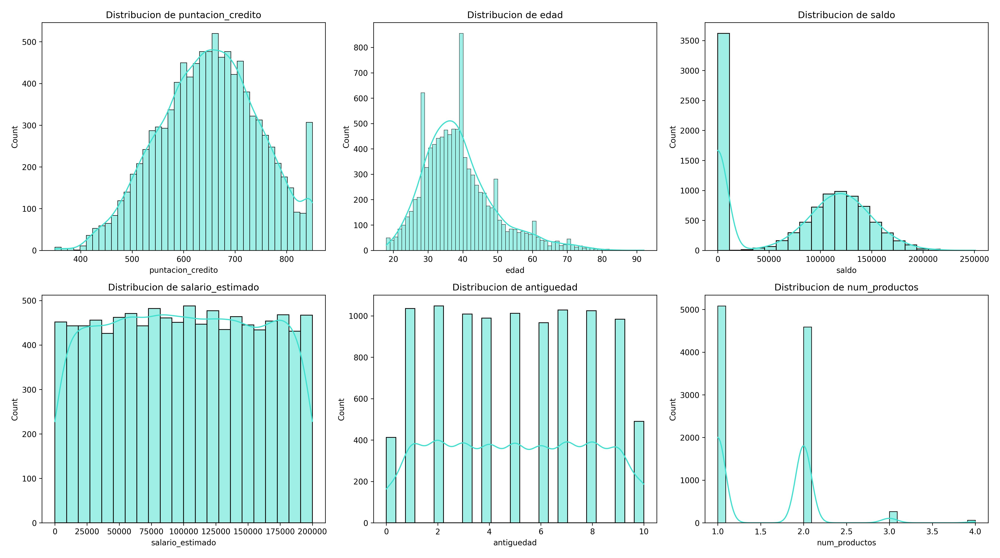

# Análisis y Resultados

Este documento contiene los resultados del análisis exploratorio de los clientes de **BlueBank**, una entidad financiera ficticia que busca comprender los factores que influyen en el abandono de clientes. 

📌 **Objetivo del análisis**

- Obtener un **perfil general de los clientes de BlueBank**, analizando sus características demográficas y financieras.  
- Identificar **factores clave que pueden influir en el abandono**, segmentando clientes en función de si han abandonado en algún momento.  
- Proponer **estrategias de retención basadas en datos**, con el objetivo de minimizar la pérdida de clientes y mejorar la fidelización.  

El análisis se estructura en **dos grandes partes**:  
🔹 **1️⃣ Perfil general de los clientes de BlueBank**, donde se analizan las características generales de la base de clientes.  
🔹 **2️⃣ Perfil de clientes según abandono**, donde se comparan los clientes que han abandonado con los que nunca lo han hecho, identificando diferencias clave y proponiendo estrategias de retención.  

---

## 1️⃣ Perfil genérico del cliente

## 1️.1. Análisis de la distribución de variables categóricas

Los gráficos de tipo pie chart permiten visualizar la proporción de clientes en cada una de las categorícas analizadas.

### 🔹 **Pie chart de variables categorícas**

A continuación, se presentan los Pie chart de las variables analizadas:

### 🔹 **País**

- La mayoría de los clientes provienen de **Francia (50,1%)**, seguido por **Alemania (25,1%)** y **España (24,8%)**.
- Francia representa la mitad de la base de clientes, lo que podría influir en análisis posteriores.

### 🔹 **Género**

- **Hombres (54,6%)** y **Mujeres (45,4%)**.
- La diferencia no es drástica, pero podría ser relevante para el análisis de abandono.

### 🔹 **Tarjeta de crédito**

- **70,6% de los clientes poseen tarjeta de crédito**, mientras que el **29,4% no**.
- Podría ser interesante evaluar si esta variable influye en el abandono.

### 🔹 **Membresía activa**

- **51,5% de los clientes están activos**, mientras que el **48,5% están inactivos**.
- Esto indica que el banco tiene casi la misma cantidad de clientes activos e inactivos, lo que puede ser un factor a considerar en estrategias de fidelización.

### 🔹 **Abandono**

- **79,6% de los clientes nunca han abandonado**, mientras que el **20,4% ha abandonado alguna vez, pero actualmente sigue en el banco**.
- Esto indica que, aunque la mayoría de los clientes han permanecido en la entidad sin interrupciones, hay un grupo significativo que en algún momento decidió abandonar y luego regresó.
- Analizar las razones detrás de estos abandonos y reingresos podría proporcionar información valiosa para mejorar la retención de clientes.

---

## 1️.2. Análisis de la distribución de variables numéricas

Este análisis se basa en histogramas y estadísticas descriptivas para entender cómo se distribuyen los clientes según diferentes métricas.

### 🔹 **Histogramas**

A continuación, se presentan las distribuciones de las variables numéricas:

### 🔹 **Distribución de puntuación de crédito**

- Distribución **normal sesgada a la izquierda**, con valores entre **600 y 750**.
- Pico inusual en **850**, lo que indica clientes con excelente historial crediticio.
- Algunos valores atípicos en los puntajes más bajos (~350-450), lo que podría representar clientes con mayor riesgo financiero.

### 🔹 **Distribución de edad**

- Mayoría de clientes entre **30 y 50 años**.
- Picos en ciertas edades, lo que sugiere estrategias comerciales enfocadas en grupos específicos.
- **Grupo de clientes mayores de 60 años con valores atípicos**, que podrían tener necesidades distintas, se estudiará de manera más detallada.

### 🔹 **Distribución de saldo**

- Gran cantidad de clientes con **saldo 0**, lo que sugiere inactividad o bajo uso del banco, podría ser punto de estudio más detallado.
- **Distribución bimodal**, con otro grupo fuerte alrededor de **100.000**.
- El segmento con saldo bajo podría estar en **riesgo de abandono**.

### 🔹 **Distribución de salario estimado**

- **Distribución uniforme**, indicando que el banco atiende a clientes de distintos niveles salariales.
- No hay valores atípicos en esta variable.

### 🔹 **Distribución de antigüedad**

- Distribución **uniforme**, sin grandes variaciones entre años.
- **Sin valores atípicos**, lo que indica estabilidad en la captación de clientes.
- No hay una concentración clara en ciertos rangos de antigüedad.

### 🔹 **Distribución de número de productos**

- **Distribución multimodal**, con picos en **1, 2 y 3 productos**.
- La mayoría de clientes tienen **1 o 2 productos**, mientras que los que tienen **4 productos** son pocos y pueden representar un segmento especial.

---

## 1.3. Análisis de valores atípicos (Boxplots)

Los boxplots nos permiten visualizar valores extremos que pueden ser clave para entender el comportamiento de los clientes.

### 🔹 **Boxplots de variables numéricas**

A continuación, se presentan los boxplots de las variables analizadas:

### 🔹 **Puntuación de crédito**

- Mediana alrededor de **650-700**.
- **Valores atípicos en la parte baja (~350-450)**, indicando clientes de alto riesgo financiero.

### 🔹 **Edad**

- La mayoría de los clientes tienen entre **30 y 50 años**.
- **Muchos valores atípicos en edades superiores a 60 años**, lo que indica la existencia de un grupo de clientes mayores con patrones distintos.

### 🔹 **Saldo**

- Se confirma la presencia de **clientes con saldo 0**, lo que coincide con el análisis de histogramas.
- Gran variabilidad en los saldos, con clientes que llegan hasta **250.000**.
- **El segmento con saldo 0 podría estar inactivo o en riesgo de abandono**.

### 🔹 **Salario estimado**

- No presenta valores atípicos.
- Se mantiene la distribución homogénea observada en los histogramas.

### 🔹 **Boxplots de antigüedad**

- **Sin valores extremos** ni anomalías en la distribución.
- Esto indica que el banco ha estado adquiriendo clientes de manera constante a lo largo del tiempo.

### 🔹 **Boxplots de número de productos**

- **Clientes con 4 productos aparecen como valores atípicos**, lo que podría indicar un grupo de alto valor.
- Los clientes con menos productos pueden ser **más propensos al abandono**.

---

📌 **Basándonos en los análisis anteriores, el perfil general del cliente del banco es el siguiente:**

✅ **Edad promedio:** Entre **30 y 50 años**, siendo 39 años la edad media.  
✅ **Saldo promedio:** Alrededor de **100.000**, aunque existe un grupo con saldo **0**.  
✅ **Puntuación de crédito promedio:** Entre **600 y 750**, con pocos clientes de alto riesgo.  
✅ **Salario estimado:** Distribuido de manera uniforme, indicando diversidad en niveles salariales, no parece ser un factor diferenciador en el comportamiento de los clientes.  
✅ **Antigüedad en el banco:** Distribución **uniforme**, sin valores atípicos, lo que indica una captación de clientes constante en el tiempo.  
✅ **Número de productos contratados:** La mayoría de clientes tienen **1 o 2 productos**, mientras que un grupo reducido con **4 productos** puede representar un segmento especial del banco.  
✅ **País predominante:** **Francia (50,1%)**, seguido de Alemania (25,1%) y España con (24,8%).  
✅ **Distribución por género:** **Más clientes hombres que mujeres**, aunque la distribución es bastante homogénea (**54,6%** y **45,4% respectivamente**).  
✅ La mayoría de los clientes **(70,6%) tienen tarjeta de crédito**, lo que indica que es un producto clave en la relación con el banco.
✅ El porcentaje de **miembros activos y no activos es similar (51,5% y 48,5% respectivamente)**, lo que podría indicar oportunidades de fidelización.
✅ **El 79,6% de los clientes nunca han abandonado el banco**, lo que indica una tasa de retención alta, pero es importante identificar qué factores influyen en el abandono.
✅ **Grupo con valores atípicos:** Clientes mayores de **60 años**, clientes con saldo **0** y clientes con **4 productos**, que podrían comportarse de manera diferente.

🔍 A continuación se analizarán las diferencias en el **perfil de los clientes que han abandonado alguna vez el banco**, comparándolo con aquellos que nunca lo han hecho, para identificar los factores que podrían influir en el abandono.

---

## 2️⃣ Análisis de diferencias clave entre clientes que han abandonado y los que no

Tras segmentar los clientes en función de si han abandonado alguna vez el banco o no, se han calculado estadísticas descriptivas y generado visualizaciones para analizar las diferencias en las variables más relevantes.

### 🔹 **Resumen de diferencias generales entre los grupos**

Inicialmente, se han analizado **todas las variables disponibles** para identificar diferencias entre los clientes que han abandonado alguna vez y los que nunca lo han hecho.

Posteriormente, se ha realizado un segundo análisis para determinar **cuáles de esas diferencias son realmente relevantes** para el abandono y cuáles tienen un impacto menor o nulo.

A continuación, se presenta un resumen de los hallazgos clave:

📌 **Diferencias relevantes** (seleccionadas para análisis visual):  
✅ **Edad** → Los clientes que han abandonado son, en promedio, **más mayores**.  
✅ **Saldo** → Los clientes que han abandonado tenían, en promedio, **un saldo ligeramente mayor**.  
✅ **País** → La mayoría de los clientes que han abandonado son **alemanes**, mientras que los que no han abandonado son **franceses**.  
✅ **Membresía Activa** → La mayoría de los clientes que han abandonado eran **inactivos (64% No activos)**.

📌 **Diferencias mínimas o sin impacto claro** (no graficadas):  
❌ **Puntaje de crédito** → No hay una diferencia significativa entre los grupos.  
❌ **Número de productos** → La diferencia es mínima (**1,48 vs 1,54 productos en promedio**).  
❌ **Tarjeta de crédito** → No parece influir en el abandono (**70% de los que abandonaron tenían tarjeta, frente a 75% de los que no han abandonado**).

---

## 2️.1. Análisis visual de las diferencias entre los grupos

Se han generado gráficos que comparan las distribuciones de edad, saldo, país y membresía activa en función del abandono. Estos análisis permiten identificar patrones y definir estrategias de retención.

### 🔹 **Histograma de Edad según Abandono**

📌 **Hallazgos clave:**

- La mayor concentración de clientes se encuentra entre los **30 y 40 años**.
- Los clientes que han abandonado están más presentes en edades **entre 40 y 50 años**.
- Se detectaron algunos valores atípicos en clientes mayores de **60 años**, pero no representan un patrón claro de abandono.

📌 **Estrategias de retención:**

- Crear **programas de fidelización** para clientes mayores con beneficios exclusivos.
- Potenciar herramientas digitales y productos adaptados a clientes jóvenes para mantener la retención en este segmento.

---

### 🔹 **Boxplot de Saldo según Abandono**

📌 **Hallazgos clave:**

- No hay una **relación directa entre saldo y abandono**.
- Existen clientes con **saldo 0 en ambos grupos**, lo que indica que tener saldo bajo no es un factor determinante.
- Los clientes con saldo más alto están presentes en ambos grupos, lo que sugiere que no es un predictor clave del abandono.

📌 **Estrategias de retención:**

- Segmentar clientes por **hábitos financieros** en lugar de solo por saldo.
- Implementar **ofertas personalizadas para clientes con mayor capital**, incentivando su permanencia.

---

### 🔹 **Gráfico de Barras de País según Abandono**

📌 **Hallazgos clave:**

- **Francia** tiene la mayor cantidad de clientes que no han abandonado.
- **Alemania y España** tienen una proporción más alta de clientes que han abandonado en comparación con Francia.

📌 **Estrategias de retención:**

- Evaluar si las políticas del banco son menos atractivas en Alemania y España.
- Personalizar estrategias de marketing y beneficios según el país.

---

### 🔹 **Gráfico de Barras de Membresía Activa según Abandono**

📌 **Hallazgos clave:**

- **64% de los clientes que han abandonado no eran miembros activos**.
- En cambio, la mayoría de los clientes que nunca han abandonado eran activos.

📌 **Estrategias de retención:**

- Implementar programas de **engagement** para clientes inactivos.
- Ofrecer incentivos a los clientes que mantengan actividad constante en sus cuentas.

---

📌 **Conclusión del análisis de abandono**

✅ **Edad y membresía activa son los factores con mayor impacto en el abandono,** sin embargo, aunque la edad muestra una diferencia entre los clientes que han abandonado y los que no, el análisis de outliers (clientes mayores de 60 años) **no aporta información clave**, ya que representan un grupo minoritario sin una tendencia clara de abandono. Por ello, el enfoque se ha mantenido en la diferencia de edad media entre ambos grupos, en lugar de profundizar en los valores extremos.  
✅ **El saldo no parece ser un factor determinante**, aunque los clientes con mayor saldo podrían representar un segmento interesante para la retención.  
✅ **El país de origen influye en el comportamiento del cliente**, con Alemania y España mostrando más abandonos en comparación con Francia.  
✅ **Los clientes inactivos tienen una mayor tasa de abandono**, lo que sugiere que el banco podría implementar estrategias para fomentar su engagement.
