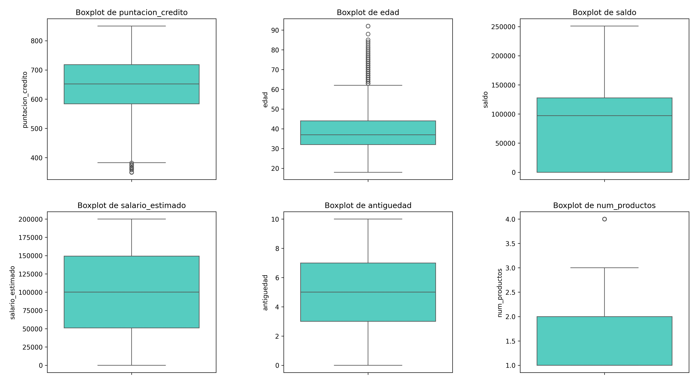

# Análisis y Resultados

Este documento contiene los resultados del análisis exploratorio de los clientes del banco, incluyendo estadísticas descriptivas, histogramas y boxplots. El objetivo es obtener un perfil general del cliente del banco y detectar patrones que puedan influir en el abandono -> PDTE: Ajustar cuando tengamos todos los analisis hechos

---

## 1️⃣ Perfil genérico del cliente

## 1️.1. Análisis de la distribución de variables numéricas

Este análisis se basa en histogramas y estadísticas descriptivas para entender cómo se distribuyen los clientes según diferentes métricas.

### 🔹 **Histogramas**

A continuación, se presentan las distribuciones de las principales variables numéricas:

### 🔹 **Distribución de puntuación de crédito**

- Distribución **normal sesgada a la izquierda**, con valores entre **600 y 750**.
- Pico inusual en **850**, lo que indica clientes con excelente historial crediticio.
- Algunos valores atípicos en los puntajes más bajos (~350-450), lo que podría representar clientes con mayor riesgo financiero.

### 🔹 **Distribución de edad**

- Mayoría de clientes entre **30 y 50 años**.
- Picos en ciertas edades, lo que sugiere estrategias comerciales enfocadas en grupos específicos.
- **Grupo de clientes mayores de 60 años con valores atípicos**, que podrían tener necesidades distintas, se estudiará de manera más detallada.

### 🔹 **Distribución de saldo**

- Gran cantidad de clientes con **saldo 0**, lo que sugiere inactividad o bajo uso del banco, podría ser punto de estudio más detallado.
- **Distribución bimodal**, con otro grupo fuerte alrededor de **100.000**.
- El segmento con saldo bajo podría estar en **riesgo de abandono**.

### 🔹 **Distribución de salario estimado**

- **Distribución uniforme**, indicando que el banco atiende a clientes de distintos niveles salariales.
- No hay valores atípicos en esta variable.

### 🔹 **Distribución de antigüedad**

- Distribución **uniforme**, sin grandes variaciones entre años.
- **Sin valores atípicos**, lo que indica estabilidad en la captación de clientes.
- No hay una concentración clara en ciertos rangos de antigüedad.

### 🔹 **Distribución de número de productos**

- **Distribución multimodal**, con picos en **1, 2 y 3 productos**.
- La mayoría de clientes tienen **1 o 2 productos**, mientras que los que tienen **4 productos** son pocos y pueden representar un segmento especial.

---

## 1.2️. Análisis de valores atípicos (Boxplots)

Los boxplots nos permiten visualizar valores extremos que pueden ser clave para entender el comportamiento de los clientes.

### 🔹 **Boxplots de variables numéricas**

A continuación, se presentan los boxplots de las variables analizadas:

### 🔹 **Puntuación de crédito**

- Mediana alrededor de **650-700**.
- **Valores atípicos en la parte baja (~350-450)**, indicando clientes de alto riesgo financiero.

### 🔹 **Edad**

- La mayoría de los clientes tienen entre **30 y 50 años**.
- **Muchos valores atípicos en edades superiores a 60 años**, lo que indica la existencia de un grupo de clientes mayores con patrones distintos, se realizará un estudio detallado.

### 🔹 **Saldo**

- Se confirma la presencia de **clientes con saldo 0**, lo que coincide con el análisis de histogramas.
- Gran variabilidad en los saldos, con clientes que llegan hasta **250.000**.
- **El segmento con saldo 0 podría estar inactivo o en riesgo de abandono**.

### 🔹 **Salario estimado**

- No presenta valores atípicos.
- Se mantiene la distribución homogénea observada en los histogramas.

### 🔹 **Boxplots de antigüedad**

- **Sin valores extremos** ni anomalías en la distribución.
- Esto indica que el banco ha estado adquiriendo clientes de manera constante a lo largo del tiempo.

### 🔹 **Boxplots de número de productos**

- **Clientes con 4 productos aparecen como valores atípicos**, lo que podría indicar un grupo de alto valor.
- Los clientes con menos productos pueden ser **más propensos al abandono**.

---

📌 **Basándonos en los análisis anteriores y las estadísticas descriptivas de las variables categóricas, el perfil general del cliente del banco es el siguiente:**

✅ **Edad promedio:** Entre **30 y 50 años**, siendo 39 años la edad media.  
✅ **Saldo promedio:** Alrededor de **100.000**, aunque existe un grupo con saldo **0**.  
✅ **Puntuación de crédito promedio:** Entre **600 y 750**, con pocos clientes de alto riesgo.  
✅ **Salario estimado:** Distribuido de manera uniforme, indicando diversidad en niveles salariales, no parece ser un factor diferenciador en el comportamiento de los clientes.  
✅ **Antigüedad en el banco:** Distribución **uniforme**, sin valores atípicos, lo que indica una captación de clientes constante en el tiempo.  
✅ **Número de productos contratados:** La mayoría de clientes tienen **1 o 2 productos**, mientras que un grupo reducido con **4 productos** puede representar un segmento especial del banco.  
✅ **País predominante:** **Francia (50,1%)**, seguido de Alemania (25,1%) y España con (24,8%).  
✅ **Distribución por género:** **Más clientes hombres que mujeres**, aunque la distribución es bastante homogénea (**54,6%** y **45,4% respectivamente**).  
✅ La mayoría de los clientes **(70,5%) tienen tarjeta de crédito**, lo que indica que es un producto clave en la relación con el banco.
✅ El porcentaje de **miembros activos y no activos es similar (51,51% y 48,49% respectivamente)**, lo que podría indicar oportunidades de fidelización.
✅ **El 79,63% de los clientes nunca han abandonado el banco**, lo que indica una tasa de retención alta, pero es importante identificar qué factores influyen en el abandono.
✅ **Grupo con valores atípicos:** Clientes mayores de **60 años**, clientes con saldo **0** y clientes con **4 productos**, que podrían comportarse de manera diferente. 

🔍 Se analizarán los **valores atípicos de la variable edad** para identificar si este grupo tiene un comportamiento distinto y su posible relación con el abandono, ya que es la **variable con más potencial de impacto** en la retención de clientes. Posteriormente, se segmentarán los clientes según abandono y membresía activa para profundizar en los factores que influyen en su salida del banco.

---
## 2️⃣ Análisis de valores atípicos en edad  

En este análisis se compararon las **estadísticas descriptivas** de los **clientes mayores de 60 años** con los **clientes menores de 60 años** para identificar si existían diferencias significativas en su comportamiento financiero y su relación con el abandono.  

---

### 📌 **Conclusión del análisis de valores atípicos en edad:**  
🔹 **Los clientes mayores de 60 años no tienen un comportamiento financiero muy diferente al resto** en términos de saldo, número de productos, puntuación de crédito o salario.  
🔹 **La única diferencia significativa** es que son más propensos a ser **miembros activos** (80,8% vs 50,1%).  
🔹 Aunque su **tasa de abandono** es un poco mayor (24,8% vs 20,2%), **la diferencia no es lo suficientemente grande** como para considerarla un factor crítico.  
🔹 **Por lo tanto, podemos decir que los valores atípicos en edad NO influyen significativamente en el abandono ni en el comportamiento financiero de los clientes, salvo en la probabilidad de ser miembros activos.**  

---

### 📌 **Hipótesis sobre la mayor probabilidad de ser miembros activos**  

Dado que los clientes mayores de 60 años muestran **una mayor tasa de membresía activa**, se pueden plantear las siguientes hipótesis sobre este comportamiento:  

1️⃣ **Han sido clientes durante más tiempo y han desarrollado mayor lealtad hacia la entidad.**  
2️⃣ **Los clientes mayores pueden percibir más riesgos o dificultades al cambiar de banco, prefiriendo mantenerse en la misma entidad por comodidad o confianza.**   
3️⃣ **Los clientes más jóvenes pueden cambiar de banco con más frecuencia buscando mejores tasas, menos comisiones o mayor flexibilidad.** 

Estas hipótesis podrían ser investigadas en más profundidad con datos adicionales sobre el uso de productos financieros, interacción con el banco y patrones de retención de clientes.  

---

